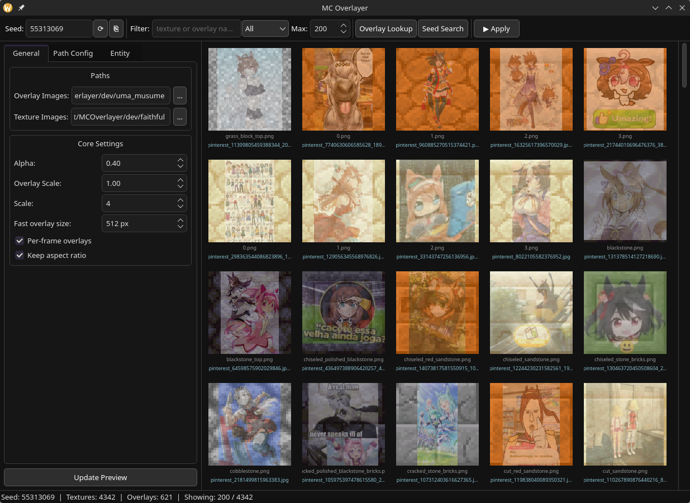

# MCOverlayer

A toolkit for compositing arbitrary image collections onto Minecraft resource packs.
The original use-case is merging large sets of anime (or other) images into a texture pack as a
joke — each texture gets one of the source images blended into it, assigned by a seed so the
mapping is reproducible.

## What it does

MCOverlayer takes two directories — a folder of **source images** (the images you want to paste
in, e.g. a folder of downloaded anime pictures) and a folder of **target textures** (a Minecraft
resource pack) — and produces an output pack where every texture has had one of the source images
composited onto it. The same seed always produces the same assignment.

Entity textures are handled specially: face region definitions in `entity_regions/` ensure the
source image is composited face-by-face (head, body, limbs separately) rather than smeared across
the entire UV sheet.

## Tools

| Tool | Description |
|------|-------------|
| `mcoverlayer-gui` | Interactive preview + apply; the primary tool for day-to-day use |
| `mcoverlayer-cli` | Headless batch processor; suitable for automation and scripting |
| `mcoverlayer-region-editor` | Visual editor for the entity face-region JSON files |

## Documentation

| Guide | Contents |
|-------|----------|
| [docs/building.md](docs/building.md) | Build instructions for Linux, macOS, and Windows |
| [docs/concepts.md](docs/concepts.md) | Core concepts: seeds, overlays, entity regions, path config |
| [docs/gui.md](docs/gui.md) | GUI walkthrough |
| [docs/cli.md](docs/cli.md) | CLI reference with full argument table |
| [docs/region-editor.md](docs/region-editor.md) | Region editor walkthrough |
| [docs/entity-regions.md](docs/entity-regions.md) | Entity regions JSON format and extraction scripts |

## Screenshot



## Quick start

### GUI

```
mcoverlayer-gui
```

1. **General tab → Overlay Images**: point to your folder of source images.
2. **General tab → Texture Images**: point to the resource pack folder you want to modify
   (or a copy of it).
3. Click **Update Preview** to see the assignment thumbnails.
4. Adjust seed, alpha, scale, and other settings as desired.
5. Click **▶ Apply** to write the composited textures.

### CLI

```bash
# Basic: composite dev/dataset onto dev/faithful, write results to dev/target
mcoverlayer-cli dev/dataset dev/faithful --output-dir dev/target

# With entity face regions and a fixed seed
mcoverlayer-cli dev/dataset dev/faithful \
    --entity-regions entity_regions \
    --seed my-cool-pack \
    --output-dir dev/target
```

## Building

Requires **CMake ≥ 3.20** and **Qt 6** (Core, Gui, Widgets, Concurrent). See [docs/building.md](docs/building.md) for platform-specific instructions.

```bash
cmake -B build -G Ninja -DCMAKE_BUILD_TYPE=Release
cmake --build build
```

A `deploy` target runs automatically and populates `build/dist/` with the executables, the shared library, Qt dependencies, and the `entity_regions/` data directory — ready to zip and ship.

## Repository layout

```
entity_regions/     entity UV face-region JSON files (tracked in git)
apps/
  cli/              command-line tool
  gui/              Qt GUI
  region_editor/    entity region editor
libs/
  core/             shared library (image processing, entity loading, config)
scripts/
  extract_entity_regions.py   generate entity_regions/ from decompiled game source
  analyze_entity_textures.py  audit entity_regions/ for missing textures
  deprecated/       original Python implementation (superseded by C++)
docs/               documentation
dev/                runtime data, gitignored (resource packs, image datasets, build output)
```
